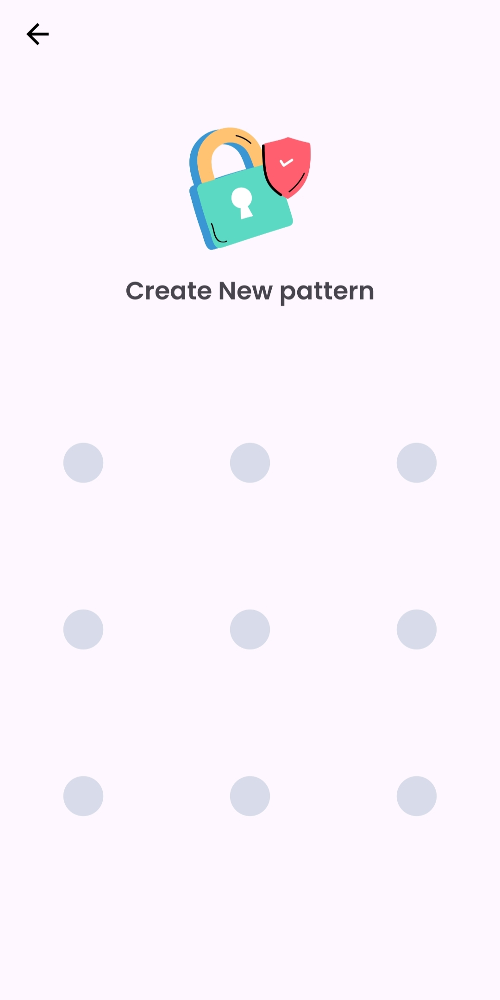

# FileFusion
[](LICENSE)  
[](https://developer.android.com)  
[](https://kotlinlang.org/)

FileFusion is an advanced file management app that provides secure file storage with features like **AES encryption/decryption**, a **password-protected vault**, and smart file categorization for photos, videos, and APKs.

> **⚠ Note:** This app is currently in development and may contain bugs or crashes. Contributions and feedback are welcome to improve the application.
---

## Features

### 🔒 File Encryption & Decryption
- Securely encrypt and decrypt files using **AES encryption** to protect sensitive data.

### 🗝️ Secure Vault
- Store private files in a password-protected vault for enhanced privacy.

### 🔐 Password Lock
- Protect the app and vault with a customizable password for added security.

### 📁 Smart Categorization
- Automatically organize files into categories such as **photos**, **videos**, and **APKs**, making them easy to locate.

### 🎨 Intuitive UI
- User-friendly and visually appealing interface for seamless navigation.

---

## Screenshots
Here are some previews of the app:

  

  


## How to Clone and Run the Repository

Follow these steps to set up the FileFusion app in Android Studio:

### Prerequisites
- Android Studio (latest version recommended)
- JDK 8 or above
- Basic knowledge of Android development

### Steps to Clone
1. **Clone the Repository**
   ```bash  
   git clone https://github.com/shivamtechstack/FileFusion.git  
Open in Android Studio

Open Android Studio.
Select "Open an Existing Project".
Navigate to the cloned FileFusion repository and select it.
Sync the Gradle Files

Android Studio will automatically prompt you to sync Gradle files.
Ensure all dependencies are downloaded successfully.
Run the Application

Connect your Android device or start an emulator.
Click the Run button or use Shift + F10 to launch the app.
Contributing
Contributions are welcome! If you'd like to improve the app or fix bugs, follow these steps:

Fork the repository.
Create a new branch for your feature/bugfix:
bash
Copy code
git checkout -b feature-name  
Commit your changes:
bash
Copy code
git commit -m "Add feature description"  
Push to the branch:
bash
Copy code
git push origin feature-name  
Submit a pull request.
License
This project is licensed under the MIT License - see the LICENSE file for details.

Contact
For any queries or feedback, feel free to reach out:

Email: shivam16yadav16@gmail.com
LinkedIn:

Tags
#FileManagement
#FileEncryption
#SecureVault
#PasswordProtection
#AndroidDevelopment
#Kotlin